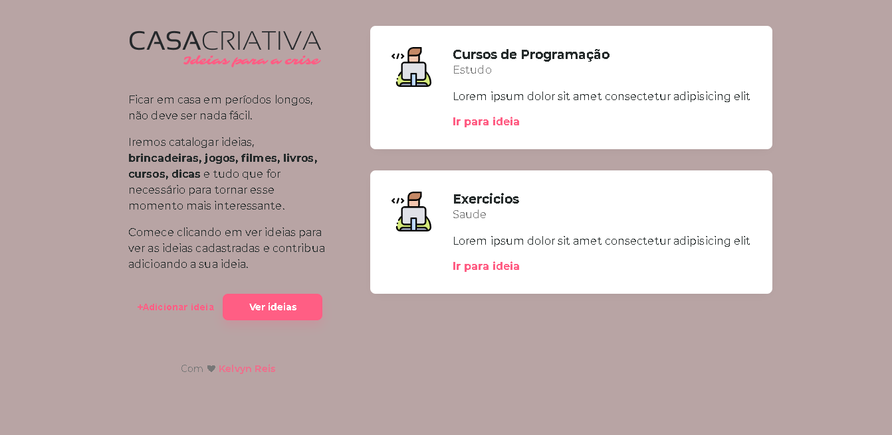

# Casa Criativa

<h1 align="center">
    
</h1>

## 🚀Tecnologias

Esse projeto foi desenvolvido utilizando as  seguintes tecnologias

- [Node.js](https://nodejs.org/en/)
- [Javascript](https://www.javascript.com/)
- [SQLite](https://www.sqlite.org/index.html)

## Projeto

A casa criativa é um projeto que tem como objetivo criar ideias para esse momento atual que estamos vivendo

Umas dos objetivos principais é catalogar ideias como <strong>brincadeiras, jogos, filmes, livros, cursos, dicas</strong> e tudo que for necessário para tornar esse momento mais interresante.

## Creditos

Este é um projeto desenvolvido seguindo o **[Workshop-Dev](https://youtu.be/cprMYC8PCVY)**, realizado pelo canal da **[@Rocketseat](https://github.com/Rocketseat)**.